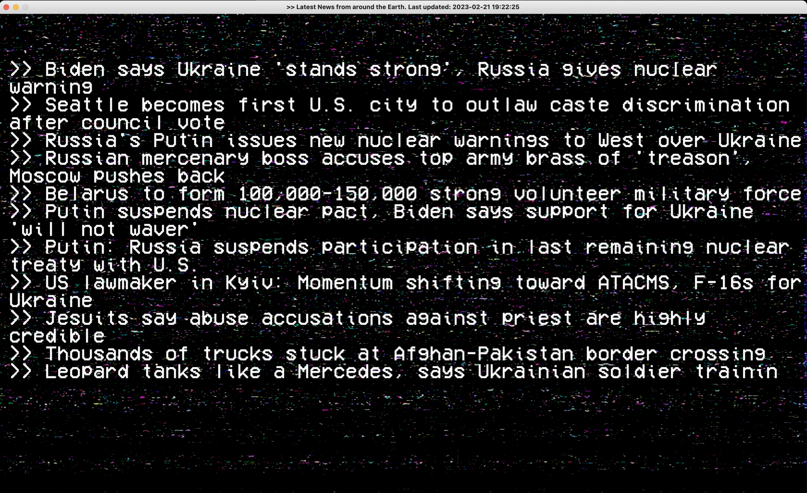

# pygame-retro-news-feed

 Display current news with a retro type effect using pygame.

I wanted to create a retro type news feed to possible use with a raspberry pi connected to an old tv or crt. I am using BeautifulSoup to parse the news. Be aware tha this will eventually stop working if the news site makes any changes to their site.

 Here is a quick walk through. Basic set up for pygame. In the main loop we are doing some basic event listeners then getting the news. This call return_news() which does a few things to get the current news and limit the calls to parse the news site.

I am storing the date/time the last time the news was parsed and saved to the news.txt file and the news in a json file.

I am doing a check if there is news and the current time is less than an hour return the news saved in news.txt. If the news is more than an hour call out and parse the news site and save the new date/time and the latest news. 

This should limit the calls to parse the news site to once an hour while this application is running.

